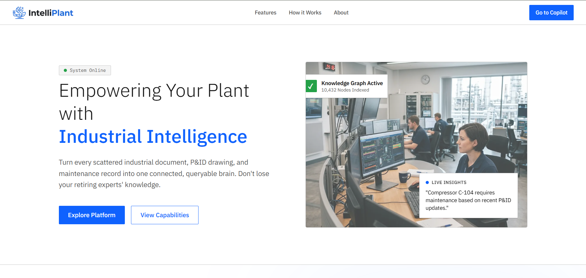
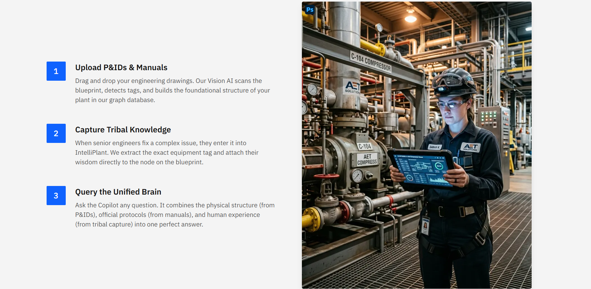
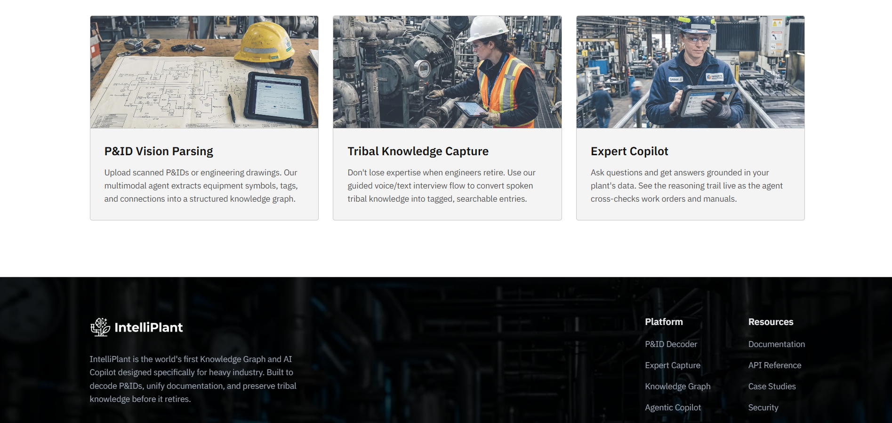
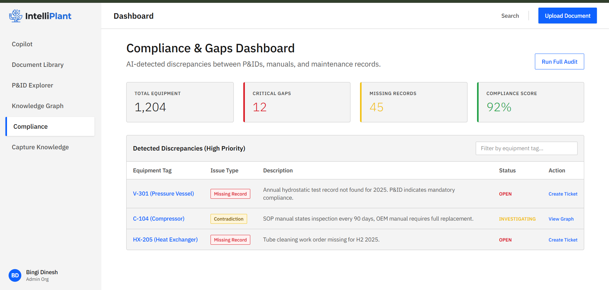
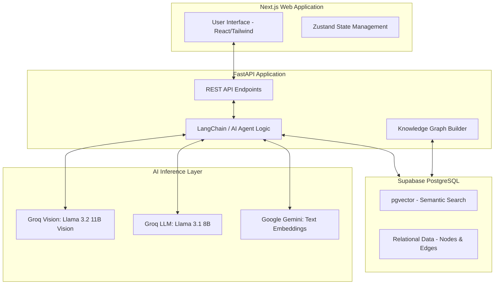
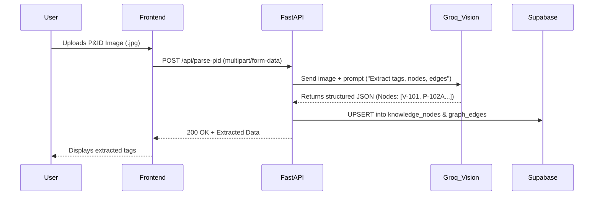
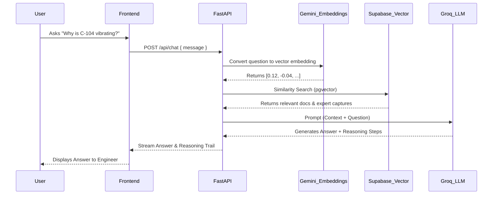

# IntelliPlant 🏭🧠

### 🚀 Live Demo: [https://intelliplant.vercel.app/](https://intelliplant.vercel.app/)

---

## 📸 Product Showcases

### 1. Modern Industrial Intelligence Landing Page


### 2. AI-Powered Compliance & Gaps Dashboard


### 3. Integrated Process & Data Workflows


### 4. Modular Industrial Capabilities


---

## 🌟 Key Features

1. **P&ID Vision AI Decoder**: Upload static P&ID blueprint images. The system uses Groq's Vision LLMs to extract equipment tags, components, and connections, instantly converting flat PDFs/images into a structured Knowledge Graph.
2. **Tribal Knowledge Capture**: A dedicated interface to instantly save undocumented "tribal knowledge" from retiring senior engineers and pin it directly to the relevant equipment nodes in the Knowledge Graph.
3. **Contradiction Engine**: AI automatically cross-references OEM manuals against internal SOPs to detect dangerous regulatory gaps and maintenance contradictions (e.g., manual says 90 days, SOP says 180 days).
4. **Agentic Copilot with Visible Reasoning**: Ask complex questions like "What do I do if C-104 is vibrating?" The AI doesn't just give an answer—it shows its exact reasoning trail as it queries the graph, cross-references manuals, and checks expert captures.

---

## 🏗️ Architecture

IntelliPlant is built on a modern, decoupled architecture using the best of open-source AI tooling:



### Technology Stack
- **Frontend**: Next.js 14, React, Tailwind CSS, Lucide Icons
- **Backend**: Python, FastAPI, Uvicorn, LangChain
- **AI Models**: 
  - Vision: `llama-3.2-11b-vision-preview` (via Groq)
  - Reasoning: `llama-3.1-8b-instant` (via Groq)
  - Embeddings: `text-embedding-004` (via Google Gemini)
- **Database**: Supabase (PostgreSQL with `pgvector` extension)

---

## 📂 Project Structure

```text
IntelliPlant/
├── intelliplant-web/         # Next.js Frontend application
│   ├── src/
│   │   ├── app/              # Next.js App Router (Pages, Layouts)
│   │   │   ├── (dashboard)/  # Main authenticated app views
│   │   │   │   ├── copilot/          # AI Chat Interface
│   │   │   │   ├── pid-explorer/     # Vision Upload & Decoding
│   │   │   │   ├── capture-knowledge/# Tribal Knowledge Input
│   │   │   │   ├── knowledge-graph/  # Graph Visualization
│   │   │   │   └── compliance/       # Gap Detection UI
│   │   ├── components/       # Reusable React components (Sidebar, Topbar)
│   │   └── lib/              # Utility functions and API clients
│   ├── public/               # Static assets
│   ├── tailwind.config.ts    # Tailwind styling configuration
│   └── package.json          # Node dependencies
│
├── intelliplant-api/         # FastAPI Backend application
│   ├── main.py               # API routing and application entrypoint
│   ├── agent.py              # Core AI logic (Groq calls, Vision processing, RAG)
│   ├── requirements.txt      # Python dependencies
│   ├── .env                  # Environment variables (Keys)
│   ├── setup_db.py           # Supabase schema initialization script
│   └── mock_ingest.py        # Script to seed database with sample plant docs
│
├── demo-data/                # Sample data for testing and presentations
│   ├── pid_diagrams/         # Sample P&ID images
│   ├── oem_manuals/          # Sample manufacturer PDFs/Markdown
│   └── regulatory/           # Sample SOPs and compliance docs
│
├── schema.sql                # Raw SQL definition of the PostgreSQL tables
├── README.md                 # You are here
└── LICENSE                   # MIT License
```

---

## 🔄 Core Workflows

### 1. The P&ID Ingestion Workflow


### 2. The Copilot RAG Workflow


---

## 🚀 Environment Setup & Installation

### Prerequisites
- Node.js (v18+)
- Python (v3.10+)
- A Supabase account (Free tier is sufficient)
- API Keys for Groq and Google Gemini

### 1. Database Setup (Supabase)
1. Create a new project in Supabase.
2. Go to the SQL Editor and execute the contents of `schema.sql`. This sets up:
   - The `pgvector` extension.
   - Tables: `plant_documents`, `knowledge_nodes`, `graph_edges`, `expert_captures`.
   - The `match_documents` vector search function.

### 2. Backend Setup (FastAPI)
```bash
# Navigate to backend directory
cd intelliplant-api

# Create a virtual environment
python -m venv venv

# Activate environment (Windows)
venv\Scripts\activate
# Activate environment (Mac/Linux)
# source venv/bin/activate

# Install dependencies
pip install -r requirements.txt

# Create .env file
# Create a .env file based on the keys you got from Supabase, Groq, and Gemini:
echo SUPABASE_URL=your_supabase_project_url > .env
echo SUPABASE_KEY=your_supabase_anon_key >> .env
echo GROQ_API_KEY=your_groq_api_key >> .env
echo GEMINI_API_KEY=your_gemini_api_key >> .env

# (Optional) Seed the database with sample documents
python setup_db.py
python mock_ingest.py

# Run the backend server
python -m uvicorn main:app --reload --port 8000
```

### 3. Frontend Setup (Next.js)
```bash
# Open a new terminal window/tab
# Navigate to frontend directory
cd intelliplant-web

# Install dependencies
npm install

# Run the development server
npm run dev
```

### 4. Access the Application
Open your browser and navigate to: **http://localhost:3000**

---

## 📄 License
This project is licensed under the MIT License - see the [LICENSE](LICENSE) file for details.
