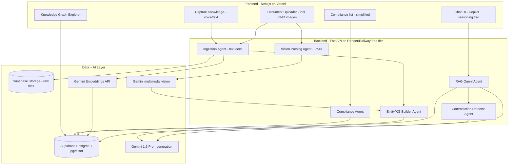

# IntelliPlant — Industrial Knowledge Intelligence Platform
### ET AI Hackathon 2.0 — Phase 2: Build Sprint
### Problem Statement 8: AI for Industrial Knowledge Intelligence — Unified Asset & Operations Brain

**Team size:** 2–3
**Submission deadline:** 22 July 2026, 11:59 PM
**Author:** Bingi Dinesh Kumar (Team Lead)

---

## 1. Problem Statement

### 1.1 The context, in one paragraph
Large Indian industrial plants run on 7 to 12 disconnected document systems — engineering drawings in one place, maintenance work orders in another, safety procedures in a third, inspection records in a fourth, and regulatory filings scattered across email. Professionals in asset-heavy industries lose roughly a third of their working time just searching for information or recreating documents that already exist somewhere. That fragmentation is directly linked to 18–22% of unplanned downtime in Indian heavy industry, because maintenance teams make decisions without full equipment history. On top of this, roughly a quarter of India's experienced industrial engineers will retire within the next decade, taking undocumented tribal knowledge with them — permanently, once they walk out the door.

### 1.2 Why this is not a "search bar" problem
Every plant already has SharePoint, email, and a shared drive. The problem was never storage — it's that nobody has built the **intelligence layer** that:
1. Understands the *relationships* between a P&ID drawing, a work order, an OEM manual, and a compliance clause — not just their text.
2. Answers a question the way a 20-year plant veteran would, with a citation, not the way a keyword search engine would.
3. Notices patterns across thousands of documents that no single human reviewer could hold in their head — recurring failure modes, compliance drift, near-miss clusters.
4. Works on a phone, in a noisy plant, for a technician standing next to the actual machine — not just at a desk for an engineer.

### 1.3 Judging criteria we are explicitly designing against
| Criteria | Weight | What "winning" looks like |
|---|---|---|
| Innovation | 25% | Not "a chatbot over PDFs" — a knowledge graph + predictive layer + retiring-expert capture story |
| Business Impact | 25% | Tied to the PDF's own cited numbers (35% time lost, 18–22% downtime, 25% retiring workforce) |
| Technical Excellence | 20% | Real RAG with measurable precision/recall, not a demo that only works on the happy path |
| Scalability | 15% | Multi-tenant, stateless services, free-tier-first architecture that provably scales to paid tiers |
| User Experience | 15% | Mobile-first for field technicians, desktop-first for engineers — both, not one |

---

## 2. Our Approach

### 2.1 The one-sentence pitch
**IntelliPlant turns every scattered industrial document into one connected, queryable brain — so a plant never has to re-learn what it already knows, and never loses what a retiring engineer knows before someone writes it down.**

### 2.2 The three pillars
1. **Ingest everything, understand structure, not just text.** PDFs, scanned forms, spreadsheets, P&IDs, email exports. Every document becomes both a set of searchable text chunks *and* a set of typed entities (equipment tags, personnel, dates, regulatory references) linked in a knowledge graph.
2. **Answer like an expert, not like a search engine.** A RAG pipeline grounded in the plant's own corpus, with every answer carrying a citation back to the exact document and page — because in a safety-critical industry, an ungrounded answer is worse than no answer.
3. **Go from reactive to proactive.** Don't just answer questions when asked — surface compliance gaps, recurring failure patterns, and "things a retiring engineer would have warned you about" before someone has to ask.

### 2.3 Our Unique Selling Point (USP) — and an honest note on what actually counts as innovation

Here is the uncomfortable truth we designed around: a judge can paste three PDFs directly into Gemini's 1M-token context window right now and get a decent, citation-ish answer with zero engineering. **Plain "RAG over documents" is not a differentiator in 2026 — it is table stakes.** Every team attempting PS8 will build some version of upload → chat → cited answer. If that is all IntelliPlant does, we are one of fifteen to thirty near-identical submissions.

So we are explicit, internally, about which features are genuine innovation and which are simply *doing RAG correctly* (necessary, but not what wins):

**Table-stakes quality bar (must be excellent, but not the pitch):**
- Citations on every answer, confidence scoring, "I don't know" instead of hallucinating. This earns trust; it does not earn a top-5 finish on its own.

**Actual differentiators (these are the pitch — see section 3.1 for what makes each one hard to replicate):**
- **P&ID / engineering-drawing visual understanding** — turning a scanned schematic into structured, queryable knowledge, not just OCR'd text. Almost every competing team will skip this because it is genuinely hard; we are not skipping it, because CV-on-technical-drawings is a strength this team already has proof of (the traffic-violation CV capstone).
- **Visible multi-step agent reasoning** — the Copilot shows its retrieval and cross-checking steps happening live ("checking the work order… checking the near-miss report… found a contradiction, flagging it… now answering"), not just a final answer with footnotes. This is the difference between "a chatbot with citations" and "an agent," and a judge can *see* the difference in ten seconds without reading a slide.
- **Cross-document contradiction detection** — requires genuine reasoning across sources, not retrieval. Two documents disagreeing (an outdated SOP vs. a newer safety bulletin) is a real, hard, novel signal to surface.
- **Retiring Expert Capture Mode** — directly answers the PS's own "knowledge cliff" statistic. Nearly every team will build the retrieval side only; almost none will build the capture side.

**One-line pitch, revised:** *IntelliPlant doesn't just answer questions about plant documents — it reads engineering drawings the way an engineer does, shows its own reasoning as it cross-checks conflicting sources, and captures the knowledge that would otherwise walk out the door with a retiring engineer.*

---

## 3. Feature Breakdown

We deliberately narrowed this from "five broad features, built shallow" to "four features built deep, plus two simplified supporting screens." A judge who pokes past the happy path will find real depth on the centerpiece features instead of everything half-finished.

### 3.1 Tier 1 — The centerpiece features (deep, bulletproof, demo-critical)

| # | Feature | What it does | Why it's genuinely hard to copy |
|---|---|---|---|
| 1 | **P&ID / Engineering Drawing Vision Parser** | Upload a scanned P&ID or engineering drawing → Gemini's multimodal vision reads the schematic → identifies equipment symbols, tags, and connections → writes them as structured nodes/edges into the knowledge graph, not just OCR'd paragraphs | Requires visual, spatial reasoning over a technical drawing, not text extraction. Most teams will only OCR text and skip drawings entirely — this is where the team's existing CV background (traffic-violation capstone) becomes a real edge |
| 2 | **Expert Knowledge Copilot with Visible Reasoning Trail** | Conversational chat that shows its work: a step-by-step trace ("checking work order… checking near-miss report… cross-referencing OEM manual…") appears live before the final cited answer | Turns "a chatbot with footnotes" into something that visibly *behaves* like an agent — a judge sees the difference in seconds, without reading a slide |
| 3 | **Cross-Document Contradiction Detector** | Actively compares retrieved passages against each other, not just against the question, and flags disagreement (e.g., an outdated SOP contradicting a newer safety bulletin) | Requires reasoning across sources, not single-pass retrieval — this is the single hardest feature on this list to fake in a live demo |
| 4 | **Retiring Expert Capture Mode** | Guided voice/text interview flow that converts a senior engineer's spoken tribal knowledge into structured, searchable, citation-backed entries tagged to equipment | Directly answers the PS's own "knowledge cliff" statistic; almost no competing team will build the capture side, only retrieval |

### 3.2 Tier 2 — Supporting screens (intentionally simplified, not abandoned)

| # | Feature | Simplified scope for this sprint |
|---|---|---|
| 5 | **Universal Document Ingestion** | OCR + chunk + embed pipeline, supporting PDF/scanned images only for the demo (DOCX/XLSX parsing noted as a fast-follow, not built if time is short) |
| 6 | **Knowledge Graph Explorer** | Visual graph view is kept, but scoped to 4 entity types only (equipment, person, date, regulation) — no attempt at a fully general ontology |
| 7 | **Compliance Gap Detector** | Single-view list of gaps against a small, pre-loaded set of OSH Code 2020 clauses (the current law — see section 4.3) plus a deliberate stale-reference test case citing the superseded Factories Act — not a full multi-tab dashboard with exports; the evidence-pack PDF export is cut unless Tier 1 finishes early |
| 8 | **Maintenance Intelligence / RCA** | Folded into the Copilot itself as a specialized prompt/view rather than a separate dashboard — recurring-pattern detection surfaces inside chat answers, not a standalone screen |

### 3.3 Quality-bar features (expected of any serious RAG system — build them, don't pitch them)
- Citations on every answer, confidence scoring (High/Medium/Low), explicit "I don't have enough information" instead of hallucinating. These earn a judge's trust during questioning; they are not, on their own, why you'd place in the top 10%.

### 3.4 Feature prioritization for the 30-day sprint
Build Tier 1 features 1–4 first, in that order, end-to-end, before touching Tier 2 polish. Feature 1 (P&ID vision) and feature 2 (reasoning trail) are the two the demo video should open with. Tier 2 screens 5–8 exist so the product doesn't look incomplete, but none of them should consume more than a few days combined — if a Tier 2 screen is fighting for time against a Tier 1 feature, Tier 1 wins, always.

---

## 4. How We Are Going to Implement It

### 4.1 Implementation philosophy
- **Free-tier-first.** Every service chosen has a free tier generous enough to build, demo, and even run a small pilot on, with a clear, documented upgrade path to paid tiers — this is what "scalable" needs to mean in the design.md/project.md sense: not "it could theoretically scale" but "here is the exact SKU we upgrade to and what it costs."
- **Agents as functions, not vague "AI magic."** Each "agent" mentioned in the PS (Ingestion Agent, Expert Copilot, Compliance Agent, etc.) is implemented as a distinct, testable FastAPI service function with its own prompt template and its own evaluation set — this is what "Technical Excellence" judges are actually looking for.
- **Everything is demoable, nothing is a screenshot.** Every feature in section 3 must work live in front of a judge, not just appear in the slide deck.

### 4.2 Tackling the hardest parts first
1. **OCR + chunking quality** is the single biggest risk — a RAG pipeline is only as good as its retrieval. Start here in Week 1, test against 5 real, messy documents (not clean ones) immediately.
2. **Citation accuracy** (the answer must point to the exact source page) is the second hardest problem and the one judges will test live — build this before building UI polish.
3. **Knowledge graph extraction** is genuinely hard to get right generically; scope it down to 4 entity types (equipment tag, person, date, regulation reference) rather than trying to extract everything.

### 4.3 Data sourcing strategy (what to actually put in the demo corpus)
Since we won't have access to a real plant's internal documents, build a credible demo corpus from public sources — with two important corrections found via live research, not assumption:

- **Regulatory reference — use the Occupational Safety, Health and Working Conditions Code, 2020, not the Factories Act 1948.** As of 21 November 2025, the Factories Act 1948 (along with 12 other labour laws) was repealed and consolidated into this Code, which is the current operative law. Citing the old Act as "current regulation" in the Compliance Agent's reference corpus would read as a real gap in due diligence to any judge who knows this space. Source a working PDF from a government `.nic.in` domain (e.g., a High Court mirror of the central Act text) rather than relying on `indiacode.nic.in`'s search or old deep links — that site's own DSpace search and several of its historical direct-download links are currently broken/stale, confirmed by testing them directly, not assumed.
- **Keep a small Factories Act 1948 excerpt too — repurposed as a deliberate stale-reference test case.** Seed one synthetic internal SOP that still cites "Factories Act Section 21" and have the Contradiction Detector flag that the cited law has been superseded by the OSH Code 2020. This is a stronger, more realistic demo moment than a generic "two documents disagree" example, because regulatory drift after a real legal consolidation is exactly the kind of thing a real plant's document set would actually contain right now.
- **OISD safety standards — read them for structure and language, but do not commit the actual downloaded PDFs to the repo.** Many OISD standards carry an explicit "FOR RESTRICTED CIRCULATION... shall not be reproduced or copied... without written consent from OISD" notice printed on the document itself. Instead, write short (1–2 page) original reference documents in OISD's clause-numbered style covering the same topics (e.g., work permit systems, pressure vessel inspection intervals) — this avoids any reproduction concern entirely and is no worse for the demo, since the point is proving the ingestion and compliance-mapping pipeline works, not the industrial precision of the reference text itself.
- Sample P&ID / equipment manuals (many OEMs publish sample manuals publicly, e.g., pump/compressor manufacturers) — or a simple hand-drawn P&ID (draw.io/Lucidchart, 4–5 labeled equipment symbols) if a public sample isn't easily found; sufficient for proving the vision pipeline works.
- Synthetic but realistic maintenance work-order logs (generate ~200 rows with GPT-assisted synthetic data generation, styled like a real CMMS export)
- A few "recorded expert knowledge" voice/text snippets you record yourselves, to demo Feature 4

This corpus should be checked into the repo (`/demo-data`) so the judges can literally see what's being ingested, which builds technical credibility — with the OISD-style documents as your own original text, not reproduced copies, per the note above.

---

## 5. Workflow Breakdown

### 5.1 Primary user journey — Engineer asks a question (now with visible reasoning + contradiction check)
1. Engineer logs into the web app (desktop).
2. Lands on the Knowledge Copilot chat screen.
3. Types (or picks a suggested) question: *"Why did Compressor C-104 fail last quarter?"*
4. Backend RAG Query Agent embeds the query → retrieves top-k chunks from Supabase pgvector → also queries the knowledge graph for structured relationships involving `C-104`.
5. **The reasoning trail streams into the UI step by step, in real time, before the final answer**: "Checking maintenance work orders…" → "Checking near-miss reports…" → "Checking OEM manual…" → "Comparing sources for conflicts…" — each line appears as its retrieval actually completes, not as a fake pre-scripted animation.
6. **The Contradiction Detector agent compares the retrieved passages pairwise.** If the 2023 SOP says one maintenance interval and the OEM manual says another, this is flagged inline as a "Conflicting sources" callout before the answer is generated — the engineer sees the disagreement, not just a synthesized answer that silently picked one source.
7. Gemini 1.5 Pro synthesizes an answer, grounded only in retrieved context, with inline citations.
8. Answer streams back into the chat UI with citation chips (click → opens source doc at the right page) and a confidence score badge.
9. If confidence is low, the UI explicitly shows "Low confidence — source documents may be incomplete" instead of asserting the answer plainly.

### 5.2 P&ID / engineering drawing vision workflow (centerpiece feature)
1. User uploads a scanned P&ID or engineering drawing (image or PDF) via the Document Library.
2. The Vision Parsing Agent sends the image to Gemini's multimodal endpoint with a structured prompt asking it to identify: equipment symbols, tags/labels, and the connections/pipework between them.
3. Gemini returns a structured JSON description of what it sees (equipment type, tag, position, connected-to relationships) — this is parsed and validated, not treated as free text.
4. Each identified piece of equipment becomes a node in the Knowledge Graph, connected to any existing entities with the same tag (e.g., if "C-104" already exists from a text document, the drawing's C-104 node merges with it rather than duplicating).
5. The original drawing remains viewable with an overlay — clicking a detected symbol on the image jumps to that equipment's entry in the Knowledge Graph Explorer.
6. This is the feature the demo video should open with, because it is the one no judge can trivially replicate by pasting a PDF into a chatbot.

### 5.3 Ingestion workflow (text documents)
1. User (engineer or admin) drags a document onto the Upload screen.
2. File lands in Cloud Storage (or Supabase Storage for the free-tier build).
3. Ingestion Agent picks it up: detects file type → OCR if scanned → chunks text (semantic chunking, ~500 tokens with overlap) → generates embeddings via Gemini Embedding API → writes chunks + vectors to Supabase pgvector.
4. In parallel, the Entity Extraction Agent pulls out equipment tags, dates, personnel names, and regulation references from the same document → writes nodes/edges into the Knowledge Graph table.
5. Document appears in the "Library" screen with a processing status badge (Processing → Indexed → Failed, with retry).

### 5.4 Compliance workflow (simplified single-view scope)
1. Compliance Agent runs (on-demand) comparing the plant's current procedures/documents against a small, pre-loaded set of OSH Code 2020 reference clauses (the current law — see section 4.3), plus a deliberately seeded stale-reference SOP that still cites the superseded Factories Act, to demonstrate the Contradiction Detector catching regulatory drift, not just document disagreement.
2. Any procedure that doesn't reference a required control, or contradicts a regulation, is flagged as a Gap.
3. Gaps appear in a single list view, each with: the regulation clause, the offending or missing procedure, and a suggested remediation.
4. PDF evidence-pack export is a fast-follow, not a Tier-1 sprint commitment — only build it if Tier 1 features are done early.

### 5.5 Retiring Expert Capture workflow (centerpiece feature)
1. Senior engineer opens "Capture Knowledge" screen.
2. Guided prompts ask structured questions ("What's a failure mode on this equipment that isn't in the manual?").
3. Engineer answers by typing or speaking (voice-to-text via Web Speech API or Gemini audio input).
4. System converts the raw narrative into a structured, tagged knowledge entry (equipment tag, failure mode, symptom, fix) and stores it exactly like an ingested document — so it becomes retrievable by the Copilot immediately, including showing up in the reasoning trail the next time someone asks about that equipment.

---

## 6. Architecture

### 6.1 High-level flow (see the rendered architecture diagram shared earlier in this conversation for the full three-layer visual)

### 6.2 Why this shape
- **Stateless FastAPI services** mean any agent can be horizontally scaled independently — the Ingestion Agent is I/O-heavy (OCR, file handling) while the RAG Query Agent is latency-sensitive; splitting them means you scale each on its own axis later.
- **Supabase as the single data backbone** (Postgres + pgvector + Storage + Auth) removes the need to stitch together 3–4 separate services, which matters enormously in a 30-day build and is genuinely how a lean, real startup would build this on a budget.
- **Gemini for both embeddings, generation, and vision** keeps you inside Google's free-tier quota (see section 7) and is a natural fit given the team's existing Google Cloud / GSA background — critically, it also means the P&ID Vision Parsing Agent needs no separate CV model, no training data, and no GPU: Gemini's native multimodal understanding does the schematic reading directly, which is what makes this centerpiece feature buildable in a 30-day sprint instead of a research project.
- **The Contradiction Detector sits between retrieval and generation**, not bundled inside the main generation call — this is deliberate: it needs to see all retrieved chunks pairwise before the final answer is written, so it is its own agent with its own prompt and its own test cases, not a single "be careful of contradictions" instruction buried in the main RAG prompt.
- **Genkit wraps the RAG Query Agent, Contradiction Detector, and Capture Knowledge flow specifically** (not every agent needs it — the Ingestion Agent's OCR/chunking pipeline is plain FastAPI code, since it doesn't need tool-approval gates or LLM tool-calling). This keeps Genkit's footprint additive and targeted rather than a full-stack rewrite.

---

## 7. Tech Stack — Free-Tier-First and Scalable

| Layer | Choice | Free tier | Upgrade path when it scales |
|---|---|---|---|
| Frontend | Next.js 14 (React) | Unlimited on Vercel Hobby | Vercel Pro ($20/mo) for team + analytics |
| Hosting (frontend) | Vercel | 100GB bandwidth/mo free | Vercel Pro |
| Backend | FastAPI (Python) | — | — |
| Hosting (backend) | Render or Railway | Free web service tier (sleeps when idle) | Paid always-on instance (~$7–25/mo) |
| Database | Supabase (Postgres + pgvector) | 500MB DB, 1GB storage free | Supabase Pro ($25/mo) for 8GB DB |
| File storage | Supabase Storage | 1GB free | Scales with Supabase Pro |
| LLM generation | Gemini 1.5 Pro / Flash via Google AI Studio | Free tier (rate-limited requests/day) | Pay-as-you-go via Vertex AI |
| Embeddings | Gemini Embedding API | Free tier | Pay-as-you-go |
| **P&ID / drawing vision parsing** | **Gemini 1.5 Pro multimodal (image input, structured JSON output)** | **Same free tier as generation — no separate model, no GPU, no training data needed** | **Same Vertex AI pay-as-you-go path** |
| OCR | Tesseract.js (client) or Google Cloud Document AI free trial credits | Free / trial credits | Document AI pay-per-page |
| Auth | Supabase Auth | Free, unlimited users on free tier | Included in Supabase Pro |
| Knowledge graph store | Modelled as Postgres tables (`entities`, `relationships`) — no separate graph DB needed at this scale | Free (same Supabase instance) | Migrate to Neo4j AuraDB free tier if graph queries get complex |
| **Agent orchestration / reliability** | **Genkit (Python SDK) — layered into the existing FastAPI backend, not a replacement for it** | **Free, open source (Apache 2.0). Use the `googleAI` plugin with your existing Gemini API key — this avoids the Vertex AI/Firebase Blaze billing plan some Genkit tutorials assume** | **Genkit Firebase deployment, or Vertex AI plugin, if you later want managed hosting** |
| Version control / CI | GitHub + GitHub Actions | Free for public repos | GitHub Team |
| Design/prototyping | Canva (already in your workflow) | Free tier sufficient | Canva Pro |

**Why this is genuinely scalable, not just cheap:** every component above has a documented, one-line upgrade path (a plan tier, not a rewrite). A judge asking "how does this handle 500 plants instead of 1?" gets a real answer: Supabase Pro/Team tiers, a paid Render/Railway instance, and Vertex AI's pay-as-you-go Gemini access — no architectural rewrite required.

### 7.1 Why Genkit, specifically, and what we deliberately did not add
This was added after live research into Google's current developer catalog (not assumed knowledge), so here's the reasoning in the open:
- **Genkit's middleware system (released May 2026)** gives us, as configuration rather than hand-written code: retry-with-backoff, automatic model fallback if Gemini's free tier gets rate-limited mid-demo, and `ToolApproval` — a real interrupt/resume mechanism for the human-in-the-loop confirmation step already designed into the Capture Knowledge flow (section 5.5) and usable for the Compliance Agent's "mark resolved" gate too.
- **It layers into the existing FastAPI backend** rather than requiring a rewrite — Genkit's Python SDK is pip-installable, and its retriever abstraction is vector-store-agnostic, meaning our existing Supabase pgvector setup is wired in as a custom retriever, not replaced.
- **It uses the same Gemini API key already budgeted for**, via the `googleAI` plugin — this deliberately avoids the Vertex AI / Firebase Blaze billing plan that some Genkit + Firebase tutorials assume, which would break the free-tier promise of this whole document.
- **What we explicitly did not adopt:** Vertex AI Agent Builder / Agent Search's grounded-generation APIs looked relevant but are gated behind "contact Google Cloud sales" for the features that matter — not self-serve, not free-tier accessible, wrong fit for a 30-day hackathon build. Google's other agent framework, ADK, is a legitimate alternative but is designed for standalone multi-agent systems built from scratch around Vertex AI infrastructure — switching to it this late would mean restructuring the whole backend around a different framework for marginal benefit over layering Genkit into what we already have. Bringing up "we evaluated ADK and chose Genkit for these specific reasons" in a judge Q&A is itself a small technical-maturity signal — it shows a deliberate choice, not just the first Google tool that came up in a search.

---

## 8. Evaluation Focus Alignment

The PS's own evaluation focus for this problem statement is: *entity extraction accuracy, query answer quality on domain-expert benchmark questions, knowledge graph linkage completeness, time-to-answer vs. traditional search, compliance gap detection accuracy, and improvement in cross-functional knowledge discovery.*

Build a small **benchmark question set** (15–20 questions with known correct answers from your demo corpus) and literally measure and report:
- % answered correctly with citation
- average time-to-answer vs. manual document search (time yourselves doing it manually as a baseline — this becomes a killer demo-video moment)
- entity extraction accuracy on a manually-labelled sample of 20 documents
- **P&ID vision parsing accuracy** — manually label the equipment symbols on 3–5 sample drawings yourself, then report what % the Vision Parsing Agent correctly identified. Even an imperfect number (say, 70–80%) reported honestly is more credible to a judge than an unverified claim of "AI-powered drawing understanding"
- **Contradiction detection precision** — seed 5–10 deliberate contradictions across your demo corpus (an SOP that disagrees with a manual) and report how many the Contradiction Detector actually caught

Putting these numbers in the deck is worth more than any amount of adjective-heavy claims about "AI-powered" — it's exactly what "demonstrated improvement... ideally validated with real industrial document samples" is asking for.

---

## 9. Error Handling & Reliability

- **Ingestion failures:** if OCR or parsing fails on a document, mark it `Failed` with a specific reason (unsupported format, corrupted file, scan quality too low) — never fail silently.
- **RAG "no answer" handling:** if retrieval returns no chunks above a similarity threshold, the Copilot explicitly says it doesn't have enough information rather than guessing.
- **Rate limit handling:** use Genkit's built-in `Retry` middleware (exponential backoff with jitter) on every Gemini call, and configure `Fallback` to a secondary model if the free-tier quota is hit during the live demo — this is a few lines of middleware config, not hand-written retry logic that's untested under real failure conditions.
- **Citation integrity:** every generated answer is programmatically checked to confirm its cited chunk IDs actually exist in the retrieved set before being shown to the user — prevents citation hallucination.
- **Human-in-the-loop safety gates:** the Capture Knowledge save step and the Compliance "mark resolved" action both go through Genkit's `ToolApproval` middleware — the action interrupts and waits for explicit user confirmation before committing, rather than relying on frontend code alone to enforce this.
- **Auth/permissions:** Supabase Row Level Security (RLS) scoped by organization from day one, even in the demo — shows judges you're thinking about multi-tenant real-world deployment, not just a single-user toy.

---

## 10. Team Roles & Sprint Timeline (30 days)

| Person | Primary responsibility |
|---|---|
| You (Team Lead) | RAG pipeline, backend agents, architecture, deck |
| Teammate 2 | Frontend (Next.js), UI implementation from design.md |
| Teammate 3 | Data (corpus prep, knowledge graph, compliance mapping, demo video) |

**Week 1:** Foundation — repo, Supabase schema, text ingestion pipeline, basic chat UI, first end-to-end RAG answer with citations working (even if rough)
**Week 2:** Centerpiece feature 1 & 2 — P&ID Vision Parsing Agent working on real sample drawings; visible reasoning trail streaming into the Copilot UI
**Week 3:** Centerpiece feature 3 & 4 — Contradiction Detector working with seeded test cases; Retiring Expert Capture flow end-to-end. Tier 2 screens (Knowledge Graph Explorer, simplified Compliance list) built in parallel by whichever teammate isn't on the Tier 1 features
**Week 4:** Benchmark measurement (accuracy numbers per section 8), demo video centered on P&ID parsing + reasoning trail as the opening 60 seconds, deck, GitHub cleanup — Tier 2 polish only if time remains after this

---

## 11. Deliverables Checklist (per the Unstop submission requirements)

- [ ] Detailed document (this file + design.md, exported to PDF if required)
- [ ] 3–4 minute demo video — script: problem (10s) → live query on real plant document (60s) → knowledge graph view (30s) → compliance gap detection (30s) → retiring-expert capture demo (30s) → benchmark numbers slide (20s)
- [ ] GitHub URL — clean README, `.env.example`, setup instructions, demo data included
- [ ] Architecture diagram (exported image)
- [ ] Presentation deck (8–10 slides)
- [ ] Working prototype URL (Vercel deployment)

---

## 12. Winning Strategy Summary — an honest version

No document can promise a top-5 finish; too much depends on the other teams' submissions and the judges' taste on the day. What this plan can honestly claim is that it stops being a median "RAG chatbot with a knowledge graph" submission and becomes something with at least two features a judge cannot trivially reproduce by pasting a PDF into a chatbot. That is the actual bar being aimed at.

1. **Open the demo with P&ID vision parsing, not the chat screen.** This is the single most visually convincing "this isn't just a wrapper around an LLM" moment available — lead with it in the first 30 seconds of the video, not buried on slide 7.
2. **Let the reasoning trail run live, on camera, unscripted.** Don't fake it with a pre-recorded animation — the real value is a judge watching the retrieval steps actually happen at demo-question time.
3. **Show the contradiction detector catching something real** — seed one deliberate contradiction in the demo corpus and let the judges watch it get caught live.
4. **Show, don't claim, everywhere else** — every judging criterion has a number attached to it in the demo (section 8), not an adjective.
5. **Keep Tier 2 screens honest about their own scope** — a simplified compliance list that works completely beats a full dashboard that breaks under a judge's off-script question.
6. **Keep the tech stack honestly free-tier and honestly scalable** — when asked "what happens at scale," there's a real, specific answer instead of hand-waving.
7. **Polish the UI per design.md** — User Experience is 15% of the score and is often where otherwise-strong RAG demos lose the most avoidable points.
